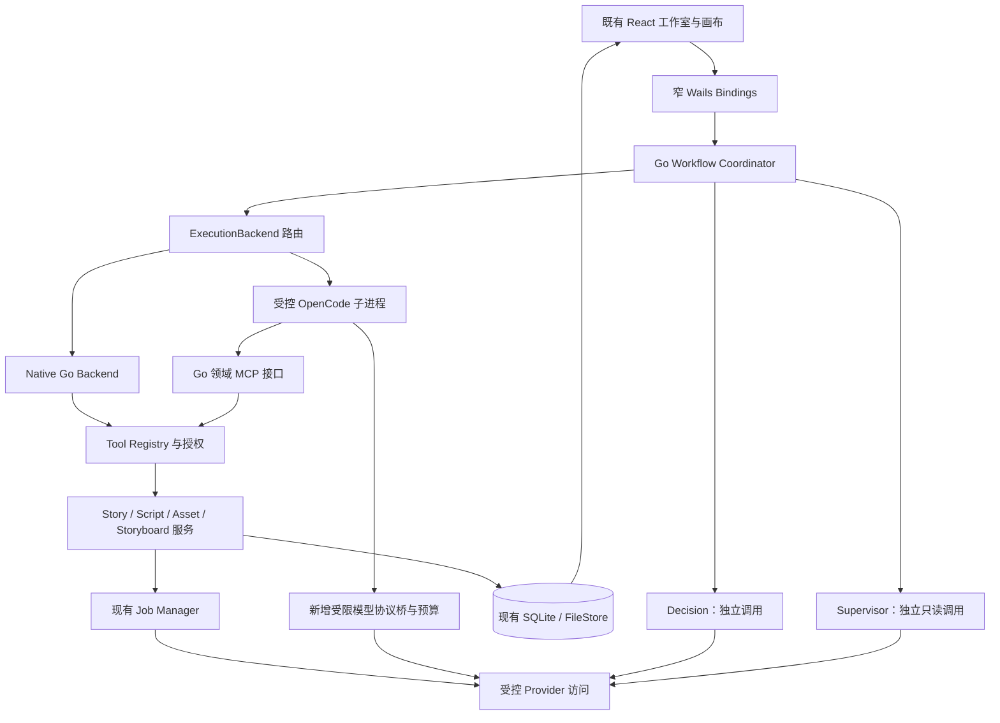

# Infinite Atelier：OpenCode 集成必要性评估与完整实施方案

> 日期：2026-09-18  
> 对象：infinite-atelier-mine-0903 当前工作区  
> 状态：研究报告与实施提案，尚未实施  
> 方法：只读源码追踪、规格与实现交叉检查、OpenCode 官方接口核对  
> 本次未修改目标仓库、未运行应用或付费模型、未读取用户数据库与凭据、未执行项目测试。

## 结论先行

**这个项目有集成 OpenCode 的条件性价值，但没有“必须集成才能成为专用行业智能体”的技术必要。建议把 OpenCode 作为可选 Execution 后端做小范围验证，保留 Go 对领域、工作流、权限、预算和持久化的控制。当前不建议把产品整体改造成 OpenCode 宿主，也不建议把它设为 MVP 的强制依赖。**

理由不是抽象偏好，而是当前代码的具体情况：

1. 项目已经实装 Wails/Go、SQLite、Provider 安全访问、持久生成 Job，以及短剧领域和版本服务。它所缺的主要是把这些能力连接成受控 Agent 执行闭环。
2. Decision/Execution/Supervision 三层 Agent 已在规格中定义，但检查的生产代码里尚未发现完整运行时、工具注册/授权循环和持久 AgentRun 实现。OpenCode 可以减少部分动态工具循环建设，但不会补齐业务状态机和质量门。
3. 现有 Provider 文本协议只有普通消息与文本流，尚不能直接承接 OpenCode 的 tool calling。集成还需要模型协议桥、MCP 工具面、运行记录、权限和进程管理，不能按“一次接口替换”估算工作量。
4. 原架构明确选择 Go 本地桌面和单进程 MVP。增加 OpenCode 子进程是需要明确记录的架构例外；它有打包、配置隔离、版本兼容和额外资源成本。
5. 最值得试验的是“基于已批准事实形成故事骨架/改编候选，并根据 Review Issue 做局部修订”。图片/视频的提交、轮询、下载继续由已有 Job/Provider 执行。

**推荐顺序：校准当前工作包与代码基线 → 建立运行时无关的 WP-07 核心 → 一个故事骨架场景的原生 Go 基线 → 同契约的 OpenCode 可选执行器 → 对比评估后再决定是否产品化。**

“原生 Go 基线”也是待实现的能力，本文没有把它写成已有三层运行时。可以先做接口与确定性假运行时，再并行开发两个有限实现；不要求先造完整通用 Agent 框架。

---

## 目录

1. [项目定位、证据规则与实际路径](#a01)
2. [已实现能力与真实缺口](#a02)
3. [必要性、收益与替代方案](#a03)
4. [拟议架构决策 ADR-OC-01](#a04)
5. [目标架构与三层 Agent 分工](#a05)
6. [Go RuntimePort、会话与结果契约](#a06)
7. [领域工具与 MCP 接口](#a07)
8. [模型网关、预算与版本兼容](#a08)
9. [持久化、事务、恢复和事件](#a09)
10. [故事骨架试点与短剧生产扩展](#a10)
11. [桌面 UI、画布投影和用户门](#a11)
12. [部署、隔离与供应链](#a12)
13. [分阶段工作包与文件级改动](#a13)
14. [评估、验收、停止条件和回滚](#a14)
15. [实施任务说明与交付清单](#a15)
16. [证据索引、版本指纹和研究限制](#a16)

<a id="a01"></a>
## 1. 项目定位、证据规则与实际路径

### 1.1 路径纠正

实际找到并读取的项目目录为：

```text
F:\AI_Movie_Things_202606\Infinite_Atelier_Drama_Studio_Spec_Pack_v1.0\infinite-atelier-mine-0903
```

原消息将若干下划线分隔的目录名写成了多层路径。本文依据上面的真实目录，未将先前 T8 项目的结论套用过来。

研究开始时 Git HEAD 为 `eb23186abc722f10688ac17a43d91eb21bfdb8a0`。最终复核时，外部并行工作已将 HEAD 推进到 `a419dee5eaea0be2d081f82cad757515589aa160`，分支为 `codex/wp-01-desktop-foundation`，相对跟踪分支 ahead 12。本报告已读取新增的 WP-05 状态及 ADR-0007/0008，并以该复核状态修订结论。

开始时已有 .zcode 计划文件、drama_settings_test.go 和 assets_wp05_test.go 等用户修改；结束复核时，测试变更已随外部提交进入版本库，仍有 .zcode 计划文件修改。本任务未修改、提交、暂存或清理任何目标仓库文件。

### 1.2 使用的技能与边界

- `analyze`：用于只读跨文件核查、区分事实/推论/未知；将 Agent/Provider 与 Workflow/领域两个子系统拆成有界的并行阅读。
- `architecture-decision-records`：用于比较备选、记录代价、保留回滚条件；本文 ADR 状态为 Proposed。

分析阶段不改产品代码。用户本次明确要求完整方案，因此在分析后形成实施提案；没有因技能的只读分析范围而停止文档交付。

### 1.3 证据等级

| 标签 | 含义 |
|---|---|
| 已确认：源码 | 在具体代码、迁移和调用链中可定位；不等于本次运行测试通过 |
| 已确认：规格 | PRD、Agent 契约或 ADR 的产品要求；不等于已经实装 |
| 推论 | 由已确认事实得出的必要性、接缝或风险判断 |
| 建议新增 | 本方案提出的接口、数据表、工具和工作包 |
| 待实测 | API 联调、模型质量、费用、性能或运行恢复，当前无本次测量结果 |

文中 〔E01〕 等编号对应第 16 章带绝对路径和行号的证据表。第 4—15 章未明确称“现有”的部分均为拟议设计。

<a id="a02"></a>
## 2. 已实现能力与真实缺口

### 2.1 实际技术栈

| 层 | 本次确认 | 精度说明 |
|---|---|---|
| 桌面宿主 | Wails v2.15.0 | go.mod 直接依赖版本 |
| Go | go.mod 声明 1.25.0 | 未运行 toolchain 验证 |
| SQLite | modernc.org/sqlite v1.58.0 | Go 依赖声明 |
| React | react/react-dom 19.2.5 | web/package.json 精确声明 |
| Web 工具 | Vite ^7.3.0、TypeScript ^5、Tailwind ^4 | 范围，不等于已安装精确值 |
| UI/数据 | Ant Design、React Router、TanStack Query、Zustand | 既有前端栈，无须因 OpenCode 替换 |
| 持久层 | SQLite repositories、版本/revision、内容寻址 FileStore | 实现已存在 |
| 模型访问 | Go Provider registry、受控 HTTP、SecretRef、文本/图片 adapter | 不等于所有多模态 provider 已生产可用 |

依据：〔E01〕、〔E02〕、〔E03〕。这里不是 Electron/Express 项目，不能复制 T8 的进程和接口设计。

### 2.2 WP-05 的最新状态与范围

最新 STATUS 已在 2026-09-18 记录 WP-05 在其声明范围内 COMPLETE，ADR-0007/0008 也已补齐；对应源码实际包含：

- main.go 声明并绑定 DramaBinding、AssetsBinding；
- app.go 启动时调用 composeDrama 并 attach；
- drama_wiring.go 创建 Story、Script、Storyboard、Workflow、Staleness 和 Assets 服务；
- 数据库迁移已出现 000006—000012；
- Web 侧已有 studio 页面与 drama binding client。

因此，**不能说短剧业务还只有规划，也不能把 WP-05 完成扩展成 WP-07 Agent 已完成。** 当前正确描述是“领域模型、基础服务与工作室壳已有实现和接线，仓库已记录对应测试；本次研究没有重新运行这些测试”。依据：〔E03〕—〔E07〕、〔E33〕、〔E34〕。

最新状态记录同时明确了限制：领域事件流尚未实现；多个版本族尚无批准命令；骨架/策略读取与故事实体列表等用例需补齐；部分写入和实体完整性能力留给后续包。骨架试点必须包含对应批准用例，不能只凭数据库允许 approved 值就当作用户门已可用。

研究初读时确曾看到“WP-05 未开始”和缺少 ADR 的旧状态；这些在最终复核时已经被外部提交解决，不再作为本报告的当前阻塞项。

### 2.3 能力成熟度矩阵

| 能力 | 本次确认的层次 | 不应扩大成的结论 |
|---|---|---|
| 桌面、SQLite、FileStore | 存在真实 startup wiring | 不能据此证明所有目标平台都通过 |
| Provider Gateway | Go 应用服务与 adapter 存在 | 不是已经开放给 OpenCode 的 HTTP 推理服务器 |
| 持久生成 Job | 有 submit/worker/lease/recovery/result 流程 | 不是任意 Agent 会话都能安全恢复 |
| 剧集、骨架、剧本、分镜 | 有领域、应用、repo 与 binding | 不是 LLM 已自动贯通全生产链 |
| Workflow/Stage/Review/UserGate | 有表、领域状态、读写与事件 | 不是已实现 WP-07 自动编排与质量门执行器 |
| Canvas | 数据库 node/document/edge revision 与投影服务 | 不需要先做 T8 式文件 JSON 写入协调 |
| Decision/Execution/Supervision | 已批准规格很完整 | 检查的生产代码未发现完整三层运行时 |
| AgentRun/Skill/Tool ACL/Memory | 规格定义，部分领域留有来源字段 | 来源 ID 存在不代表相应运行时和记忆模块存在 |
| OpenCode | 主要生产代码未发现集成 | 不能把开发工具配置当成产品内置能力 |
| 多模态真实运行 | 文本、图片有实际 adapter；视频/音频有 mock 契约与遗留路径 | 不能将 mock 支持写成真实 provider 已验收 |

〔E08〕—〔E18〕提供关键依据。未检出结论限于当前检查的生产代码范围，不涉及外部服务或未提供的私有实现。

### 2.4 当前最值得保留的机制

1. **领域所有权**：数据库是事实来源，Canvas 是投影，Zustand 是临时交互状态。
2. **短剧版本**：Episode、StorySkeletonVersion、ScriptVersion、AssetVersion 等已有业务含义。
3. **安全访问**：Secret 不通过普通 Wails binding 暴露，模型访问走受控服务。
4. **Job 生命周期**：生成工作持久化、取消、恢复和物化与 Agent 对话分离。
5. **审阅概念**：ReviewReport、ReviewIssue、UserGateDecision 已有结构基础。

OpenCode 应接在这些机制之上，不取代它们。

### 2.5 影响集成的真实缺口

**协议缺口。** TextRequest 只有 ProviderID、Model、Messages、Stream；消息角色只接受 system/user/assistant。OpenAI 文本请求构造与 SSE 解析没有完整 tools/tool_calls/tool-role round trip。不能简单把 OpenCode 的请求转发给现有 TextRequest。〔E15〕、〔E16〕

**运行时缺口。** 尚需 Agent Registry、Skill 版本、工具授权、结构输出、调用记录、取消、次数限制及阶段执行协调。OpenCode 自身会话状态不能替代这些业务契约。

**预算缺口。** provider_requests 中的 token/cost 观测字段，不是发送前预算预留与强制额度。审计缺失和零值语义也需与计费未知区分。〔E17〕

**事务缺口。** 不能认定全部领域方法都具有跨聚合原子性。资产批准存在先 supersede 旧版本、再批准新版本、再更新指针的多次写路径；OpenCode 自动写入前应补齐必要事务，不扩大自动化覆盖范围。〔E19〕

**恢复缺口。** 现有 generation job 恢复规则不能直接复制到 Agent prompt：提交可能已被运行时接收，但 session/input ID 尚未成功登记。直接重排会导致重复调用。〔E20〕

**审核缺口。** 有 UserGateDecision 存储不等于拥有审批执行完整事务。Agent 调用面还要禁止伪造 user actor、approved 版本和任意阶段转移。

<a id="a03"></a>
## 3. 必要性、收益与替代方案

### 3.1 分开回答三个问题

| 问题 | 判断 | 置信度 |
|---|---|---|
| 做成行业智能体是否需要某种受控 Agent 运行时？ | 是；已有规格明确要求 | 高：规格和缺失模块可核对 |
| 这个运行时必须采用 OpenCode 吗？ | 否；受控 Go 实现也能满足相同领域契约 | 高：核心职责与特定运行时解耦 |
| 是否值得为 OpenCode 做可选试点？ | 值得，但须通过成本、质量和边界验证 | 中：工程可行性有依据，实际收益尚未测量 |

### 3.2 OpenCode 可能带来的增量

- 多轮工具调用、会话与运行事件等通用执行机制，可以减少自己维护通用循环的工作。
- 通过 MCP 复用领域工具，有利于将来同一业务服务接不同运行时。
- 对“读材料→补充查询→形成候选→按问题修订”的开放步骤，有机会比固定一次调用更适合。
- 可保持实验后端独立升级；业务模型无需随具体运行时更换。

这些是候选收益，不是已经在本项目测得的效果。OpenCode 的编程、文件与 shell 强项在本产品中必须受到严格限制，因此不能把其全部通用能力计算为行业价值。

### 3.3 OpenCode 不会自动解决的部分

不会自动给出可靠的剧本质量标准、事实支持、版本血缘、资产批准、跨阶段 stale、预算、数据库事务、供应商幂等、媒体下载或用户门。也不会把已有视频 mock 变成真实集成。

若主要工作只是固定骨架 JSON、固定剧本 JSON 和固定审阅 JSON，采用受控 Go 调用的初期实现可能更小、更容易符合单进程架构。

### 3.4 备选方案比较

| 方案 | 收益 | 额外代价 | 本项目建议 |
|---|---|---|---|
| A：原生 Go，有限工具循环 | 最符合现有架构；同一权限与数据边界 | 需自建有限 runner、取消、schema repair | 作为基线和可独立交付路径 |
| B：Go 控制层 + 可选 OpenCode Execution | 通用执行机制可复用；能与 A 比较 | 子进程、MCP、模型桥、协议兼容 | 推荐有界试点 |
| C：三层全部交给 OpenCode，Go 降为工具服务 | 同一运行时集中执行 | 迁移面大、审阅独立性和生命周期更复杂 | 当前不推荐 |
| D：直接让 OpenCode 修改数据库/项目文件 | 演示短 | 绕开领域不变量、权限、版本和审核 | 与项目规范冲突，排除 |
| E：在开发过程中用 OpenCode 写代码 | 可能帮助开发 | 不是产品能力 | 与本次“产品内集成”分开 |

### 3.5 采用的判定条件

试点结束后，仅当以下条件同时成立，才将 OpenCode 从实验选项提升为支持的产品后端：

1. 同一领域契约下的质量达到原生基线，并对目标复杂任务有可解释收益。
2. 所有强制安全、版本、幂等和审批不变量通过。
3. 所有模型请求均能归属 AgentRun，并受发送前额度控制。
4. 新增运维和协议维护成本可接受，产品在未安装 OpenCode 时仍可使用原生路径。
5. 打包、启动、退出、升级和恢复具备可重复验证记录。

没有达到这些条件时，保留可复用的 RuntimePort/ToolRegistry，停用 OpenCode 后端，继续原生 Go 路线。试点失败不必推翻领域建设。

<a id="a04"></a>
## 4. 拟议架构决策 ADR-OC-01

**标题：在 Go 领域控制层下引入可选 OpenCode Execution 后端。**  
**状态：Proposed。** 本报告没有把提案登记为仓库已批准 ADR，也没有执行该架构变化。

### 背景

PRD 固定产品决策要求 Go 负责模型、任务、Agent、记忆、数据、密钥与备份；AGENTS 的 MVP 原则为单进程本地桌面，既有桌面 ADR 的收益包含不增加 Node/服务运行时。另一方面，WP-07 尚需建设 Agent 执行能力。〔E08〕、〔E09〕、〔E21〕

### 拟议决定

- Go 保留 AgentRuntime 外观、阶段编排、领域工具、权限、预算、审核及持久化。
- 定义窄 ExecutionBackend port，提供 native 和 opencode 实现。
- OpenCode 仅作为可选、受控的本机子进程；不引入网络微服务体系、Redis 或 Kafka。
- 首批 Decision 和 Supervisor 仍走独立的 Go 管理调用；Execution 的一个明确 AgentKey 可选择 OpenCode。
- 首批不使用任意 shell、文件读写、动态插件安装、通用 HTTP 或 OpenCode 自行创建不受控子 Agent。
- 正式启用前更新单进程约束的适用范围，并为受控进程宿主建立精确静态扫描例外。不得整体关闭安全扫描。

### 代价

物理上从一个产品进程增加到产品管理的辅助进程；运行状态、资源和配置要隔离。Go 仍拥有业务执行控制，不等于“所有推理循环都在 Go 进程内”。这个差异必须明说。

首版建议一个应用实例仅一个活跃 OpenCode Execution attempt，按 attempt 管理专属会话、短期能力和实例关联。后续是否复用进程，以身份隔离与资源测量决定。

### 明确拒绝的替代

不把 Wails 迁成 Electron，不引入 Node BFF 只为使用 TS SDK，不让 OpenCode 直接读写 app.db，不让 Supervisor 与 Execution 共享可写权限，不把批准按钮暴露为模型工具。

### 回滚与重评

未接受的新任务可切回 native；已接受或已经产生模型/工具副作用的任务必须先对账，不能立即跨引擎重做。连续升级成本过高、协议桥无法完整覆盖预算、或者复杂任务质量没有改善，都触发停止扩大集成。

<a id="a05"></a>
## 5. 目标架构与三层 Agent 分工

### 5.1 架构



图中的模型桥不是现有 TextRequest 的薄包装，需要第 8 章的工具消息和流式协议扩展。所有模型调用最终执行相同费用和数据发送政策。

### 5.2 三层调用的边界

| 层 | 输入 | 输出 | 有权做的事 |
|---|---|---|---|
| Decision | 数据库工作流快照、合法动作、用户请求 | DecisionResult | 从合法动作中提出下一步 |
| Execution | 单阶段输入 refs、锁定 refs、问题 ID、幂等身份 | ExecutionResult | 读当前范围事实、创建候选 |
| Supervision | 已提交候选 refs、规则版本 | ReviewReport | 独立重新读取并评价 |
| Go Coordinator | 上述结果与持久状态 | 状态变化、任务与用户门 | 最终校验并执行合法转移 |

Decision 返回的 nextAction 是建议；Go 重新校验。ExecutionResult 的 nextAction 不具备修改工作流的权限。Supervisor 的 passed 也不等于用户已批准。

独立调用至少要有不同 AgentRun、独立角色指令、独立工具授权和上下文组装。是否采用不同模型是可配置策略，不强迫增加供应商；不同模型也不保证评价正确。

### 5.3 会话策略

首批每个 Execution attempt 创建独立 OpenCode session；FIX/REDO 创建新的 attempt，显式携带版本与 issue refs。禁止把整部作品所有角色塞进一个无限增长的聊天会话。

Supervisor 从业务数据库重新读候选，不能只读 Execution 的解释或 OpenCode 会话摘要。已有 Story Graph 是故事事实，Memory 只是检索上下文来源，两者不合并。

### 5.4 分阶段启用角色

- 试点：OpenCode 只执行 `script.execution.story_skeleton`。
- 达标后：扩展 `adaptation_strategy` 或 `production.execution.storyboard_table`。
- 对 Decision/Supervision 是否也采用 OpenCode，另做独立收益评估。
- 媒体生成始终通过 Job Service；不让 LLM 阻塞轮询或执行转码命令。

<a id="a06"></a>
## 6. Go RuntimePort、会话与结果契约

### 6.1 保持仓库已有契约方向

AGENT_CONTRACTS 已定义 RunDecision、RunExecution、RunSupervision 的目标接口及结果验证。应兑现这套契约，而不是重新发明一套与领域脱节的聊天 API。〔E09〕

建议在 Go AgentRuntime 外观内部增加可替换 ExecutionBackend。下面是**拟议 Go 接口草图**，类型由后续包实现，不是当前可直接编译的文件，也不是 OpenCode 官方 Go SDK：

```go
type ExecutionBackend interface {
    Start(ctx context.Context, req ExecutionEnvelope) (ExecutionHandle, error)
    Observe(ctx context.Context, handle ExecutionHandle, sink EventSink) error
    Reconcile(ctx context.Context, handle ExecutionHandle) (ExecutionSnapshot, error)
    Interrupt(ctx context.Context, handle ExecutionHandle) (InterruptResult, error)
}

type ExecutionEnvelope struct {
    AgentRunID        string
    StageRunID        string
    ProjectID         string
    EpisodeID         string
    AgentKey          string
    SkillVersionID    string
    InputSnapshotID   string
    PolicyVersion     string
    IdempotencyKey    string
    ExpectedRevision  int64
}

type ExecutionHandle struct {
    Backend        string
    InstanceID     string
    SessionID      string
    RuntimeInputID string
    Submission     string // prepared | accepted | unknown | rejected
}
```

具体项目输入使用已经规划的 ExecutionRequest，Envelope 携带可信运行关联。模型不能自行决定 ProjectID、Actor、权限和预算；这些信息来自绑定的服务端上下文。

### 6.2 状态与返回

Start 返回 accepted，只表示输入接收。Observe 是诊断/进度通道，不能决定最终业务成功。Reconcile 查询运行时、工具回执与候选引用，输出可供 Go 校验的观察结果。

明确区分两个结果：后端先返回自有 `ExecutionProposalResult`（提案引用）；Go 完成原子兑现后才生成仓库契约中的 `ExecutionResult`（真实 artifact 引用）。不能要求尚未提交的 proposal 已经具有领域 artifact，也不能把 proposalRef 直接当成符合原契约的成功结果。

最终 ExecutionResult 要满足：

- schemaVersion、stage、stageRunId 与本次请求一致；
- artifact 在数据库存在，属于项目与剧集；
- 产物来源可追到本 AgentRun/StageRun；
- 引用的上游版本和锁定规则仍有效；
- partial 不能自动进入 passed；
- 未完成或 unknown 的付费调用按政策处理；
- 不允许模型传入 approved 来绕过领域批准。

### 6.3 修复和重试

仓库规定一次 Schema Repair、最多两次自动业务修订。二者不同：

- Schema Repair：修复格式，无新增业务写入，最多一次。
- FIX：针对 ReviewIssue 创建新 attempt/version，保留锁定和未受影响内容。
- REDO：同一有效上游下创建新的候选版本，旧候选保留。
- 网络重试：只有证明尚未接受或供应商支持安全幂等时才自动重试。
- unknown：先查账本，不当成普通网络错误跨引擎重跑。

### 6.4 第一版采用“先提交候选提案，再统一兑现”

执行器可调用一个 `script.propose_story_skeleton` 工具，写入受控 Agent proposal 存储，返回 proposalRef。它尚不是批准的领域版本。

`ExecutionProposalResult` 通过 Schema 后，由 Go 在受控事务中验证 proposal、创建候选 StorySkeletonVersion、登记 tool/run receipts，再构造并验证带真实 artifact refs 的 `ExecutionResult`、推进到 execution_succeeded。这样避免“模型前面写了一半业务对象，最后 JSON 无效”的不清晰状态。

业务必须边执行边持久写入时，可扩展为幂等候选命令，但要明确 partial 产物归属与清理策略。不要把多次领域写操作都声称具备一次原子提交。

<a id="a07"></a>
## 7. 领域工具与 MCP 接口

### 7.1 首个工具集

以下都是拟新增工具名；现有应用服务只作为实现基础，不能说这些 MCP 工具已存在。

| 工具 | 可用角色 | 行为与复用点 |
|---|---|---|
| workflow.read_state | Decision/Execution/Supervisor | 返回授权 run 的状态与当前合法动作 |
| story.read_events | Execution/Supervisor | 按已批准版本、项目、剧集过滤的查询 |
| story.read_rules | 各角色只读 | 只返回当前范围锁定与批准规则 |
| script.read_story_skeleton | Execution/Supervisor | 读真实候选及上游 refs |
| script.propose_story_skeleton | Execution | 存结构化 proposal，不批准 |
| review.read_issues | FIX Execution | 限定本次待处理 issue ID |
| agent.submit_result | 对应角色 | 提交该角色的结构结果，随后服务端校验 |

`agent.submit_result` 若采用工具方式，也只负责提交候选结果，不允许设置 stage 状态。可替代为最终消息提取，但必须与工具产生的 proposal/receipts 核对；首版只选一种明确方式。

第二阶段才增加 storyboard 提案、asset 候选、media job 请求。现有 Application 方法与新增工具不是一一裸映射：比如 CreateStorySkeletonVersion 的调用方来源字段必须由包装层注入；没有已存在只读用例时补一个 scoped query，而非从 MCP 直连 repository。

### 7.2 明确不暴露的能力

不暴露 SQL、文件路径、任意 HTTP、shell、Secret Resolve、通用 TransitionStage、ApproveScriptVersion、SubmitGateDecision，也不暴露由模型指定的 actor type。

现有用户 binding 可调用某个方法，不代表同一方法适合直接导出到 Agent。必须建立独立权限表与业务调用入口。

### 7.3 一个工具的执行顺序

```text
短期能力凭据验证
 → session 与 AgentRun 关联核对
 → role / tool / stage 白名单
 → 参数 Schema 与大小限制
 → project / episode / input refs 所有权
 → locked / stale / revision 检查
 → 幂等 key 与 payload hash 检查
 → 调用 Application 用例
 → 持久化回执
 → 输出 Schema、脱敏和长度限制
```

MCP 元数据里的 session ID 可帮助关联，但不能单独用于鉴权。V2 工具名按 server/tool 归一；应保存“业务工具名→实际运行时工具名”映射，防止点号等字符归一后的冲突。[官方 MCP](https://opencode.ai/v2/docs/mcp-servers)

### 7.4 传输选择

本项目首选由 Go 主进程内的受控本机接口提供 MCP，OpenCode 使用 Streamable HTTP 连接。好处是工具可以直接复用已经构造的 Application 服务，不新增另一个持有 app.db 写权限的工具进程。

这意味着要新增真实 HTTP 接入面，不是 Wails binding 自动变成 MCP。仅监听宿主分配的 loopback 端口；每次运行的短期能力令牌、Host/Origin 约束、body 上限、连接上限、超时和关闭策略都属于工作包。

stdio 也可用，但工具子进程仍应通过受控 IPC 回到 Go 用例，不应再开 app.db 形成第二写入者。首版不同时实现两种传输。

### 7.5 权限模板的原则

V2 原生 permissions 采用规则列表；默认拒绝，仅允许列出的领域工具。禁止 shell/edit/通用读取/网络与不受控 subagent，MCP 设置 `codemode: false`，让首版只使用明确工具调用，符合仓库禁止任意模型脚本的要求。[权限文档](https://opencode.ai/v2/docs/permissions)、[MCP 文档](https://opencode.ai/v2/docs/mcp-servers)

配置并不是 OS 沙箱，不能据此宣称隔离了恶意运行时。产品威胁模型以经过校验的受信二进制、拒绝通用原语的执行策略、短期 scope 与服务端核验为基础；若要运行不受信插件或代码，需要更强 OS 隔离，首版不支持。

### 7.6 Skill 的两层管理

仓库规划的 `atelier.agent/v1` manifest 是本产品能力包契约；OpenCode 的 Skill/Agent 文件是运行时输入，两者不等同。

建议建立 PackCompiler：

1. 校验原始 manifest、相对路径与 hash；
2. 从内置 ToolRegistry 解析工具；
3. 生成按角色固定的 OpenCode 配置与系统指令；
4. 记录源 Skill hash、编译器版本及生成配置 hash；
5. 禁止包内声明可执行命令和自动下载 URL；
6. 未支持的字段直接拒绝，而非静默丢弃。

Story Graph、Memory、workflow state 通过查询装配上下文，不能写成用户可编辑 AGENTS 指令后让其提升为系统规则。

<a id="a08"></a>
## 8. 模型网关、预算与版本兼容

### 8.1 这是集成中不能省略的一块

现有 Go 文本 adapter 能发送普通文本消息，但缺完整工具调用消息、工具结果角色、结构输出参数和工具流增量。〔E15〕、〔E16〕

建议增加独立 AgentChat 协议，保留旧 TextRequest 不变。模型桥只支持选定的一种 OpenAI-compatible HTTP 协议轮廓；把实际 endpoint、消息结构、tool call delta、usage、结束原因和错误转换固化到契约测试。不要承诺一个代理立即兼容所有厂商和 Responses/Chat Completions/WebSocket 协议。

### 8.2 模型请求链路

```text
OpenCode
 → 本机模型桥（run-scoped capability）
 → 验证运行归属、模型白名单、请求大小和预算
 → 写 model_call = prepared/started
 → 既有受控 Provider HTTP / SecretStore
 → 外部模型
 → 转换受支持协议、登记 usage 或 unknown
 → 返回给 OpenCode
```

真实供应商密钥始终留在 Go 的 SecretStore 访问路径。OpenCode 只获得调用本机模型桥的临时能力，不获得能直接访问厂商的密钥。现有 SSRF 校验不得因内部 loopback endpoint 而全局放宽：内部客户端只允许宿主创建的具体地址，外部 provider 仍走既有策略。

### 8.3 需要支持的协议细节

- assistant tool_calls 与 tool_call_id 一致性；
- role=tool 的回传及工具消息顺序；
- SSE 分片可能把函数参数 JSON 切成多段；
- 多个工具调用的 index/ID 聚合，首版可限制执行并发；
- finish_reason 与中断/超时区分；
- usage 缺失时保留 unknown；
- 输出 token 上限和选定模型参数；
- 请求体中的任意 endpoint、headers、provider URL 均不能被模型控制；
- 未支持的多模态/推理扩展字段拒绝或按冻结协议明确处理；
- 禁止自动切换未授权模型或外发范围。

不能为兼容图省事做无限制反向代理，也不能让协议转换静默丢失工具调用或思考内容边界。

### 8.4 预算服务

新增预算准入，而不是仅复用日志字段。至少保存：

- task/run 上限、币种、价格版本；
- prepared/started/completed/unknown 请求回执；
- 当前预留、已知支出、未知支出；
- 最大模型请求数、工具数、时长、输出和并发；
- 子调用、schema repair、OpenCode 自动压缩/重试全部计入同一预算。

发送前原子检查和预留；失败未知时保留预留，确认未发送时才释放。应用崩溃后通过 model_calls 恢复未决状态。

每次预留须有可计算上界：按照冻结价格表，使用包含全部消息/工具定义的输入 token 计数或经验证的保守上界，加上强制执行的最大输出 token 与已知附加计费项。缓存折扣未确定时按未折扣价格预留。模型无法限制输出、计价未知或有无法界定的付费维度时，不宣称硬金额上限成立：拒绝该硬预算模式，或明确使用仅限制次数/时长的实验模式。unknown 保留该次预留直至对账；预算并发准入必须原子，不能让两个请求同时花同一份余额。

现有 adapter 的普通审计失败可以被忽略，不能将该路径直接承担强预算准入。新增强约束的账本写入失败时，应拒绝新付费发送。〔E17〕

### 8.5 OpenCode 版本冻结

2026-09-18 官方仍提供 V1 与 V2 文档。V2 的服务 API、客户端与插件有破坏性变化；受支持的 V1 配置可兼容读取，不代表程序接口或插件兼容。[官方迁移说明](https://opencode.ai/v2/docs/migrate-v1/)

本项目没有已部署的 OpenCode 版本需要兼容，因此先选定一个可验证版本，不同时实现 V1/V2 双栈。建议在隔离试点核验 V2，若其打包、网关或协议未达到条件，再评估其它明确版本；不能声称本文已确定生产版本。

Go 可以按冻结 HTTP schema 调用，无需为 TS 网络客户端引入 Node 服务。网络客户端包 `@opencode/client` 与嵌入 SDK 是不同入口；本文选择进程外 HTTP 边界。[网络客户端](https://opencode.ai/v2/docs/build/client/)

### 8.6 最小 API 映射

| adapter 操作 | 当前 V2 文档参考 | 业务含义 |
|---|---|---|
| Create session | POST /api/session | 建立执行上下文 |
| Submit input | POST /api/session/{sessionID}/prompt | 接收输入，非完成 |
| Interrupt | POST /api/session/{sessionID}/interrupt | 中断本进程拥有的活动执行 |
| Observe | /api/event | 实时观察，不替代业务日志 |
| 可选补读 | /api/experimental/session/{sessionID}/log | 实验性能力，按版本测试 |

API 中断不等于已提交媒体任务被撤销。实验性日志不能成为唯一恢复依据。[官方 API](https://opencode.ai/v2/docs/api)

官方网络客户端实时订阅没有自动重连/历史重放；Go adapter 同样需要明确补读和对账策略，不能假定 SSE 连接就是持久队列。[客户端事件语义](https://opencode.ai/v2/docs/build/client/)

模型桥 endpoint 可以通过自定义 provider 的 baseURL 对接，但实际模型目录、凭据配置和协议能力要在冻结版本上验证。[Provider 配置](https://opencode.ai/v2/docs/providers)

<a id="a09"></a>
## 9. 持久化、事务、恢复和事件

### 9.1 复用与新增表的边界

现有 workflow_runs、stage_runs、review_reports、review_issues、user_gate_decisions、workflow_events 已经存在；不重新建第二套同义表。〔E12〕

建议新增以下逻辑存储，最终表名和迁移编号在实施时以当时仓库最大版本为准，**不能现在假设 000013 一定空闲**：

| 新增对象 | 核心字段 | 关键约束 |
|---|---|---|
| agent_runs | ID、role、AgentKey、StageRun、Skill/Model/Policy、输入 hash、状态、版本 | 关联真实 StageRun，来源不能仅自由文本 |
| agent_invocations | run、runtime、instance/session/input ID、fingerprint、submission 状态 | 提交前持久化身份；运行指纹不可混用 |
| agent_messages | run、role、内容/附件引用、序号 | 输出限长、诊断 TTL、无 Secret |
| agent_tool_calls | run、operation ID、工具、参数 hash、开始/结束、回执 | 相同 operation 与参数返回同结果 |
| agent_proposals | run、类型、schema、payload、输入 refs、状态 | 尚未兑现的提案不冒充正式工件 |
| skill_versions | 包、版本、内容 hash、schema/tool catalog hash | 每次运行指向冻结版本 |
| model_calls | run、发送状态、usage、price version、费用已知性 | started/unknown 可恢复 |
| budget_reservations | 任务额度、预留、已结算、未决 | 发送前原子准入 |
| runtime_events / outbox | 来源事件关联、业务序号、投影/通知状态 | 可补读；不得提前宣布业务成功 |

不必将每个逻辑对象机械拆成一张表；可以在关系清晰的前提下合并，但幂等、来源、费用与状态必须可以独立核对。

### 9.2 不污染已有阶段状态

当前迁移采用：

```text
pending
running
execution_succeeded
reviewing
passed
needs_fix
needs_redo
waiting_user
failed
cancelled
superseded
```

OpenCode 的 accepted、idle、submission_unknown、interrupted 放在 agent_invocations 状态，不直接添加到 stage_runs 的 CHECK 集合。

示例：提交结果未知时，invocation 标记 outcome_unknown，stage 保留 running 并附诊断；Coordinator 经过对账决定继续、转 waiting_user 或失败。不存在“看到 OpenCode idle 就直接 Stage passed”的映射。

### 9.3 原子提交服务

建议新增 Application 层 CommitStageResult：

```text
读取已验证 proposal 与有效输入快照
 → 开短事务
 → 验证 Stage owner / revision / attempt / 未取消
 → 验证 locked/stale/上游版本
 → 创建候选业务版本及所需子实体
 → 写入工具回执与 artifact 来源
 → 写 validated_output + stage 转移事件
 → 写投影/通知 outbox
 → 提交
 → 发布事件 / 执行投影
```

模型调用和远端生成不在数据库事务内。现有服务需要提供事务感知的 command/UnitOfWork 接缝，不能在外部套事务后仍调用内部使用独立连接的 repository 方法，并声称已经统一原子性。

对于脚本版本、场景、对白、镜头这样的整包产物，先完整校验，再原子写入；否则其中一个镜头错误可能留下半份剧本。

### 9.4 本次发现的事务风险及处置次序

| 已确认边界 | 集成影响 | 建议 |
|---|---|---|
| Workflow 状态与 event 已能同事务写入 | 可复用 | 保持该事务语义 |
| Script approval 有专门 repository 批准路径 | 可复用设计 | 加入用户门授权与输入版本核对 |
| Asset approval 存在多次独立写入 | 中途失败可能导致批准状态/指针不一致 | 在启用资产自动化前做原子批准与故障测试 |
| Skeleton maxVersion+1 与 INSERT 分离 | 并发可冲突，DB 唯一约束只负责拒绝 | Command 幂等、事务或明确冲突处理 |
| Projection 先查后写 | 顺序重复可复用，不证明并发严格幂等 | 持久 operation key 或事务约束 |
| Gate decision 独立记录 | 记录批准不等于批准工件与推进阶段都已完成 | 新增 ApplyUserGate 应用事务 |

这些是本次静态核查得到的集成前置风险，尚未通过本次运行故障注入复现。首个骨架只读/草稿试点不必修完所有资产路径，但开放哪一类自动动作，就必须先验证相应事务边界。

### 9.5 活跃 attempt 的唯一性

stage_runs 的唯一约束只保证 workflow/stage/attempt 编号不重复，尚不等于“同阶段最多一个活跃执行”。WP-07 必须在短事务中 claim 当前 stage、更新 active 指针/lease，并检查已存在的活跃 attempt。

可以增加适当约束或部分唯一索引，但“活跃”应按 FIX、waiting_user 和历史版本语义定义，不凭泛化状态名随意建立索引。双击、两个 worker、恢复与手动重试同时发生时，最终只能有一个合法 owner 执行同一 attempt。

### 9.6 恢复顺序

1. 打开数据库与运行时状态，校验 runtime/config/schema fingerprint。
2. 对所有未终结 AgentRun 读取 invocation、model_calls、tool receipts 和 proposal。
3. 对 accepted/running 查询 session 与已提交结果；对 outcome_unknown 首先核对，不直接重发 prompt。
4. 已提交业务候选但响应丢失时，通过 command key 找到原回执。
5. 需要重新运行推理时，仅在证明不会重复副作用或获得明确处理决定后创建新 attempt。
6. waiting_user 仍等待用户，重启不能变成 approve。
7. Agent 恢复完成或显式隔离后再允许同一 stage 派发。

现有 Job 在 RemoteJobID 存在时恢复轮询；无 remote ID 的 running 可能重排。该规则不能直接套到 OpenCode 的接受窗口。现有恢复还应独立评估扫描范围与失败后派发行为；不把它概括成“所有任务恢复已完备”。〔E20〕

### 9.7 取消与退出

取消 UI 订阅只停止展示，不自动取消任务。用户点击取消才触发：

- 先在 Go 禁止新模型请求和新领域写；
- 向运行时发出中断；
- 对已提交生成任务调用 Job Cancel；
- 对无法取消的远端工作保留费用和结果对账；
- 迟到候选写入需要验证 cancelled/owner/revision，拒绝污染新 attempt。

第一版依然是桌面生命周期：应用退出时停止接受任务、保存运行状态、撤销短期能力、终止受控子进程，再关闭数据库。**持久恢复不是应用退出后继续运行。** 若未来需要后台常驻，应另设产品决策，不在本方案中默认引入 Windows 服务。

### 9.8 事件与画布

Wails eventPublisher 是界面事件发送，不应作为持久事实账本。〔E25〕 新增 Agent 事件必须先持久化，再发轻量变化通知；UI 根据 sequence 或实体 revision 重新查询。

Canvas 投影由 Go 领域命令/投影服务刷新，不由 OpenCode 保存画布 JSON。投影失败时保留已提交领域候选，outbox 重试投影；不为了补画布展示再次生成一份剧本。

<a id="a10"></a>
## 10. 故事骨架试点与短剧生产扩展

### 10.1 首个 Canary 的边界

选择一个测试项目、一集、少量已批准故事事实和锁定规则，执行：

```text
用户：按这些事实形成第 1 集故事骨架
 → Go 创建 Workflow/Stage 与输入快照
 → Decision 独立判断允许执行 story_skeleton
 → ExecutionBackend（native 或 opencode）
 → 查询事实/规则，提交骨架 proposal
 → Go Schema/语义/权限校验并创建 draft
 → Supervisor 独立读回 draft 和事实
 → 写 ReviewReport
 → required user gate
 → 用户选择 PASS / FIX / REDO
```

试点先使用 fixture 和 deterministic model endpoint，不消耗真实费用；之后再做受控真实模型比较。报告中的 fixture 是测试材料，不能放进生产作为假 Agent。

WP-06 真实小说导入尚未完成时，可以用人工创建并批准的领域事实或测试 fixture 验证运行时，不伪装成“整本小说自动改编已完成”。

### 10.2 复用真实骨架服务

CreateStorySkeletonVersion 已有 EpisodeID、BasedOnVersionID、故事字段、SourceAgentRunID；创建时强制 draft。〔E23〕

需要补的不是另一份“骨架 JSON 文件”，而是：

- 按项目/剧集读取已批准事实和规则的查询用例；
- 基于真实版本的输入快照；
- 由宿主注入 AgentRun/CreatedBy，不接受模型伪造来源；
- 一次 command 对应一次候选版本的幂等机制；
- source event refs 与剧情字段的语义校验；
- Supervisor 使用的 scoped draft query；
- 产物与 stage output 的一致提交。

当前 SourceAgentRunID 是来源字段预留，不是已经具有外键保证的 AgentRun 关联。新增账本后应补应用校验和适当迁移。

### 10.3 试点结果 schema

骨架内容沿用领域字段，不引入第二套产品骨架模型。建议运行时返回的最小 `ExecutionProposalResult` envelope：

```json
{
  "schemaVersion": 1,
  "stage": "story_skeleton",
  "stageRunId": "stage-example",
  "proposalRef": "proposal-example",
  "inputSnapshotId": "snapshot-example",
  "sourceEventRefs": [
    { "id": "event-example", "revision": 3 }
  ],
  "warnings": [],
  "summary": "已形成候选，等待独立审阅"
}
```

这是自有业务提案示例，不是 OpenCode API 返回，也不是最终 `ExecutionResult`。ID 值是示例；实现必须与服务端实际运行和数据库对象匹配。schema 合法之外，还要检查所引用事实确实支持骨架、时长有定义、锁定角色动机未被改写。由 Go 兑现 proposal 后，最终结果使用真实 artifact entityId/versionId，并满足原 Agent 契约。

当前骨架版本尚无完整的用户批准命令。试点需新增原子的 ApproveStorySkeletonVersion/ApplyUserGate 用例（名称为建议），完成候选状态校验、旧批准 supersede、新批准、相关指针/依赖检查、用户决策与事件的一致提交。不能调用审批记录保存后就声称骨架已经批准。

### 10.4 局部 FIX 的完整语义

用户或已授权政策选择具体 issue ID；Go 验证 issue 属于该候选与 stage，把旧版本、锁定 refs、待修改字段和当前事实版本作为新 attempt 输入。

Execution 生成新的 BasedOnVersionID 候选，不直接修改原批准版本。Go 对比哪些字段变化，拒绝超出修订范围的改动；Supervisor 重新读取新版本检查原问题和新引入的问题。超过最多两次自动修订后停在用户处理。

这里可能是 OpenCode 最有辨识度的场景：它能按问题逐步查询事实、补上下文、形成修订，而原生固定一次生成可能需要更多手动控制。但效果必须通过第 14 章比较。

### 10.5 扩展到 Production

| 顺序 | 场景 | 开放前置条件 |
|---|---|---|
| 1 | 改编策略、剧本草稿 | 骨架试点通过，剧本整包提交和源事实查询完整 |
| 2 | 分镜表与导演计划 | Script/Asset 版本稳定，相关查询、端口和规则齐备 |
| 3 | 资产分析与图片 job | 预算、Asset 原子批准、真实图片 provider 可用 |
| 4 | 分镜图、视频、配音 | 相应真实 adapter、任务对账、产物物化分别通过 |
| 5 | 记忆与长期一致性 | 先实现 WP-10 范围隔离、来源、阈值和评估 |
| 6 | 成片检查和交付 | 时间线/字幕/导出服务具备真实实现 |

不因 OpenCode 可以调用工具就提前开放尚未实装的业务能力。工具目录应来自实际 capability registry，UI 显示哪些阶段可用。

<a id="a11"></a>
## 11. 桌面 UI、画布投影和用户门

### 11.1 复用现有工作室

保留 studio 导航、现有领域列表与 Wails client。当前部分工作室页面仍明确标记未来 WP-09/WP-11，StoryGraph 列表和原文导入也有未完成边界。不能通过增加一个聊天侧栏把这些页面标记为已完成。〔E26〕

建议新增最小 AgentRunPanel：

- 当前阶段、执行状态、使用的模型和额度；
- 正在读取或写入的业务对象；
- 候选版本及来源；
- ReviewIssue 列表与定位；
- 取消、查看产物、PASS/FIX/REDO；
- outcome_unknown 的原因与对账进度。

终端、shell、运行时配置和原始 JSON 不进入普通创作者主流程。高级诊断页可提供脱敏版本和错误编号。

### 11.2 建议 Wails 方法

以下为拟议窄 binding，不是现有方法：

| 方法 | 责任 |
|---|---|
| StartStageExecution | 创建已授权 attempt，快速返回业务 run ID |
| GetAgentRun | 返回脱敏运行摘要 |
| ListAgentEvents | 按业务 sequence 查询 |
| GetStageArtifacts | 返回真实候选/版本引用 |
| CancelAgentRun | 发出持久取消意图 |
| SubmitUserGate | 可信用户路径应用 PASS/FIX/REDO |
| GetRuntimeAvailability | 告知 backend 可用性，不暴露通用进程能力 |

禁止提供 StartProcess(command)、ReadFile(path)、GenericHTTP、ExecuteSQL、ResolveSecret 等通用接口。Runtime token 不返回 WebView；前端不能直连 OpenCode 或模型桥。

### 11.3 用户门与模型权限分开

OpenCode 自身的 permission reply 不是本产品 UserGateDecision。即便运行时允许调用一个工具，也不意味着用户批准了剧本或大额生成。

产品门必须绑定项目、stage attempt、候选版本、输入快照、issue 集合、费用范围和政策版本。用户批准后内容发生变化，旧批准不能继续执行新内容。

模型没有创建 user approval 的能力。即使它在 JSON 中写 `actorType: user`，网关也要忽略或拒绝，不能依赖枚举校验当作身份认证。

### 11.4 画布投影

现有 CreateCanvasProjection/RemoveCanvasProjection/FindEntityReferences 可作为基础；node/document revision 已有数据库约束。〔E13〕、〔E14〕

新流程先创建领域实体或新版本，再更新投影引用。删除画布投影不删除领域产物；模型也不掌握任意 Canvas 数据覆盖权。

投影更新应检查 entity 属于当前项目、版本存在、当前用户选择是否仍然有效。为特定旧候选生成的结果不能无提示覆盖用户已切换的新版本。

<a id="a12"></a>
## 12. 部署、隔离与供应链

### 12.1 受控子进程宿主

建议 OpenCodeHost 由 Go Infrastructure 管理：

- 固定可执行文件绝对路径与 hash；
- 固定参数数组，不拼接 shell；
- 私有配置、状态与 scratch 目录；
- 过滤继承环境，避免读取个人 OpenCode 凭据/配置；
- 隐藏窗口，不弹出无关终端；
- 有界启动超时、health/readiness、版本校验；
- 记录 instance ID、PID 与生命周期；
- 退出时撤销能力，再中断与终止所拥有进程；
- Windows 进程树清理使用经过测试的受控机制，不杀其它用户实例。

官方 V2 CLI 可使用用户账号级共享后台服务；产品必须显式管理自己的实例，不能凭 PATH 上的默认 opencode 自动连接个人服务。[官方 CLI](https://opencode.ai/v2/docs/cli/)

### 12.2 首版部署策略

优先在受控开发环境选择一个固定二进制进行试验，不立即打包进入正式发行版。通过协议、安全和收益评估后，再决定“随应用分发固定组件”或“用户配置受支持版本”。

两种方式都必须检测兼容性。自动更新运行时不能发生在活动任务中；升级后旧 session 是否可读、是否允许恢复由 fingerprint 与兼容矩阵决定。

### 12.3 进程与授权的关联

首版采用单活跃 OpenCode attempt，可以给该 attempt 分配独立工具 token 与模型 token，避免多个 session 共享一个默认 header 后混淆账单。

能力 token 绑定 run、role、project/episode、工具集合、model、到期时间和实例；数据库保存 hash/标识而非可直接使用的长效密钥。日志与产物不包含 token。

需要并发时，先明确每个模型请求如何可靠归属 run，再扩大实例池。不能仅凭模型主动填写 runId 解决归属。

### 12.4 工作区与文件

OpenCode 的工作目录是私有运行目录，不是应用源码根，也不是 app.db 所在目录。通过工具读取已授权内容；无需为了读取一章小说就挂载完整用户素材盘。

关闭未使用的插件、代码编辑、通用文件和网络能力。临时目录与运行时诊断按政策清理；所有可交付结果经过 FileStore 登记，不把 scratch 路径当永久资产身份。

如果该版本无法可靠隔离个人全局配置或禁用不需要的执行能力，应阻断产品化，而不是让用户自己记住不要点击。

### 12.5 许可证与安全扫描

OpenCode 官方仓库当前标示 MIT；具体分发版本及其捆绑依赖仍需逐项记录 license、notice 和 SBOM，不能由主仓库许可证推导所有插件与模型许可。[官方仓库](https://github.com/anomalyco/opencode)

仓库 security-scan 当前会检查 os/exec，且只允许精确例外。新增受控 OpenCodeHost 应通过 ADR 增加单文件、单规则、明确 owner 和原因的例外，并有命令路径/参数/环境测试；禁止使用全目录 ignore。〔E22〕

不引入 Toonflow 代码、Prompt/Skill 原文或识别性素材；新 AgentPack 按本项目规格独立实现。OpenCode 的安装或集成本身不改变原项目的版权和 clean-room 要求。

<a id="a13"></a>
## 13. 分阶段工作包与文件级改动

### 13.1 与现有 Roadmap 的关系

以下 OC-* 是**本报告的实施拆分建议**，不是宣称仓库已经批准的新工作包。以新提交的 WP-05 范围记录为基线核实剩余缺口，无须重做已记录的整个 WP-05；真实小说上下文由 WP-06 衔接；Agent 接口和质量门属于 WP-07；业务 Skill 属于 WP-08/09；Memory 属于 WP-10。〔E27〕

不为试验擅自重排全部 Roadmap，也不把 OpenCode 接入算作完成完整 ScriptAgent/ProductionAgent。

### 13.2 工作包

| 工作包 | 主要内容 | 交付/放行条件 | 依赖 |
|---|---|---|---|
| OC-00 基线与决策 | 复核新提交 WP-05 的范围及未完成项；冻结版本与样本；确认试点边界 | 真实基线、Proposed/Accepted 决策状态、已知失败列表 | 当前工作包记录 |
| OC-01 运行时无关核心 | AgentRun、RuntimePort、角色 ACL、Skill/schema、一次 repair、StageCoordinator、确定性 backend | 三层独立调用到 user gate 的无付费 canary | WP-05 基础 |
| OC-02 领域工具与事务 | scoped queries、proposal、CommitStageResult、骨架批准/Gate、receipt、active attempt、outbox | 重放/越权/并发/故障测试通过 | OC-01 |
| OC-03 模型协议与预算 | AgentChat、tool SSE、模型桥、预算准入、unknown ledger | 工具消息完整往返且超额无法发送 | OC-01，可与 OC-02 分工 |
| OC-04 OpenCode 执行器 | Host、版本探测、MCP、会话/事件/中断/恢复映射 | fixture 下的真实 OpenCode 进程可用，不调用付费模型 | OC-02/03、架构例外落实 |
| OC-05 双后端评估 | 同题原生与 OpenCode，指定 FIX、质量与费用评估 | 达到预先定义的不退化和收益门槛 | OC-04，真实模型评估另行授权 |
| OC-06 小范围产品化 | UI、打包、退出/恢复、诊断、升级/回滚 | 桌面端端到端 canary + 安全不变量全部通过 | OC-05 达标 |
| OC-07 扩展业务阶段 | 选定 Script/Production 工具与 Skill | 每阶段独立验收，不批量默认放开 | WP-08/09 相应能力 |

计划工作量应拆分估算：Go 控制层、工具与事务、模型协议桥、OpenCode host、UI、测试/打包。当前未提供团队和资源数据，不给出伪精确工期。

### 13.3 建议新增模块

以下路径是相对于目标仓库的**拟新增位置**，实施时要与当前命名和包依赖规则对齐：

```text
internal/domain/agent/
    run.go
    invocation.go
    scope.go
    errors.go
internal/application/agents/
    ports.go
    service.go
    coordinator.go
    validator.go
    commit.go
    recovery.go
internal/application/agenttools/
    registry.go
    authorizer.go
    story_tools.go
    script_tools.go
internal/application/agentbudget/
    service.go
    ports.go
internal/infrastructure/agents/native/
    backend.go
internal/infrastructure/agents/opencode/
    host.go
    client.go
    protocol_v2.go
    backend.go
    events.go
internal/infrastructure/agentbridge/
    server.go
    auth.go
internal/infrastructure/modelbridge/
    server.go
    agent_chat.go
    stream.go
internal/infrastructure/database/
    agent_runs.go
    agent_tools.go
    agent_budget.go
    agent_outbox.go
internal/desktop/
    agents_binding.go
    agents_dto.go
agent_wiring.go
skills/script/
schemas/agent/
testdata/agent-canary/
web/src/services/desktop/agents.ts
web/src/components/studio/agent-run-panel.tsx
```

MCP server 处理传输，不拥有领域事实；模型桥处理受控模型协议，不变成万能代理。Domain 不引入 OpenCode、Wails 或 HTTP 类型。

### 13.4 现有文件的改动责任

| 文件/模块 | 建议修改 | 不应顺带做 |
|---|---|---|
| app.go / main.go | 声明 AgentsBinding，组装/关闭 host 与 coordinator | 不改桌面框架和全部启动架构 |
| drama_wiring.go | 注入工具所需现有服务/事务 ports | 不让 Agent 直接获得 SQL handle |
| application/script | scoped query、事务候选提交、来源/版本核验 | 不覆写批准历史版本 |
| application/workflow | claim stage、ApplyUserGate、执行协调 | 不把模型 status 直接写 DB |
| application/assets | 启用资产阶段前补原子批准 | 不在首个骨架试点重写整个资产库 |
| infrastructure/providers | 增加明确 AgentChat 能力 | 不破坏旧 TextRequest/生成流程 |
| providerhttp | 复用外部访问安全控制 | 不全局允许 loopback/private 网络 |
| event_publisher.go | 发布 Agent 变化通知 | 不作为唯一持久事件源 |
| migrations | 向前追加 Agent/receipt/budget/outbox 结构 | 不重写已发布迁移 |
| security-scan.mjs | 精确受控宿主例外及新回归规则 | 不关闭扫描、不加通配白名单 |
| docs / notices | 更新实际实现、ADR、协议与发布物 | 不提前标记后续包完成 |

### 13.5 开发顺序

先端口、状态与 deterministic tests；再领域工具和事务；随后协议桥和进程 adapter；最后 UI 与真实模型效果。

OC-04 的协议连接实验可以先用假模型服务，避免等全部业务 Skill 完成。OC-05 的 native 基线只需实现试点有限循环，不能以“比较需要”为由造第二套大型通用平台。

<a id="a14"></a>
## 14. 评估、验收、停止条件和回滚

### 14.1 不以聊天回复作为完成标准

完成标准是一个可审阅的真实领域候选，通过数据库读回核验，具备来源与费用记录，经过独立 Supervisor，并停在正确用户门。工具或运行时说“完成”不是依据。

### 14.2 无付费测试矩阵

| 场景 | 必须结果 |
|---|---|
| 错 runtime/config hash | 启动不就绪，不恢复旧状态 |
| 模型伪造 project/episode/run | 网关拒绝 |
| Decision 请求创建剧本 | ACL 拒绝 |
| Supervisor 请求写入 | ACL 拒绝 |
| Execution 请求 approve/user gate | 工具不存在或明确拒绝 |
| 文档包含注入指令 | 不改变工具权限与系统规则 |
| tool 参数 JSON 分片 | 正确拼装验证，不提前执行 |
| 输出第一次非法、第二次合法 | 只进行一次格式 repair |
| 输出第二次仍非法 | 明确失败，不创建正式候选 |
| 相同 command ID 重放 | 返回同回执，不新增版本 |
| 相同 ID 不同参数 | 冲突拒绝 |
| 两个 worker 同时 claim | 最多一个活跃 owner |
| 提交被接受但客户端超时 | outcome_unknown、先对账 |
| domain 已提交、事件发送失败 | 读回与 outbox 恢复，不再次生成 |
| candidate 创建中途崩溃 | 事务回滚或回执可确定结果 |
| 上游事实变更/被锁定 | 拒绝旧输入提交或标 stale |
| 审批后内容变化 | 旧批准不适用于新版本 |
| 用户取消后工具迟到 | 不写入新业务对象 |
| 预算不足 | 请求发送前拒绝 |
| usage 未提供 | unknown，而非零费用 |
| 关闭/重启应用 | 无孤儿执行权限，能够对账或明确等待 |
| OpenCode 缺失 | 既有手工和媒体功能继续可用；新任务可选择 native |

真实 OpenCode 进程 + 假模型 endpoint 的集成测试仍不同于单纯 mock adapter：前者验证其实际工具协议、事件和配置行为，二者都需要。

### 14.3 复用现有测试资产

已有 workflow 数据库事务、projection、script 版本、provider SSE/取消、SSRF、DNS 重绑定等测试源码可用于回归。具体名字与位置见第 16 章。

本次没有运行这些测试。STATUS 中旧 PASS 是以前工作包记录，不是本次结果；尤其 race 的旧环境失败不能写成当前通过。

### 14.4 双后端效果评估

建议建立一个小而分层的固定样本集，至少覆盖：普通骨架、长上下文检索、矛盾事实、锁定约束、指定问题 FIX、缺失输入。每类多于一个样本，记录样本数；数量由可标注资源决定，不声称小样本能证明整体生产准确率。

尽量固定模型、参数、上下文截止版本、工具目录、允许费用和输出要求，仅更换 runtime；如模型不一致，则报告为“系统组合对比”，不能把改善全部归因于 OpenCode。

| 指标 | 定义 |
|---|---|
| 有效候选率 | 通过格式、引用、范围、数据库读回和质量检查的候选 / 准入任务 |
| 原著事实违背 | 有证据支持的事实冲突数量及严重程度 |
| 锁定约束违反 | 被更改的锁定内容，不用总体平均掩盖 |
| FIX 精确性 | 修正目标问题且未破坏无关内容的比例 |
| 审核定位有效性 | issue 实体与证据能定位并有实际问题 |
| 人工修正时间 | 盲评达到可用稿所需时间 |
| 完成时延 | 冷启动、模型、工具与人工等待分开统计 |
| 综合成本 | 模型已知/未知费用、工具请求与运行资源、维护成本 |
| 协议维护负担 | 每次版本升级需修改和验证的接口范围 |

首次只要求质量不低于基线并显示具体复杂任务收益。团队在测试前填写可接受成本与延迟上限，避免看到结果后临时更改成功标准。本文不捏造百分比改善目标。

### 14.5 停止或暂缓条件

- 原生有限调用已满足当前任务，而 OpenCode 没有可测收益；
- 无法阻止运行时绕过受控模型/工具路径；
- 无法可靠关联模型请求与 run，预算仍只靠结束统计；
- 工具/事件接口与实际二进制不一致；
- 关键版本与批准事务未可靠；
- 新运行时导致安装、启动或退出明显失控；
- 需要大范围重写既有领域才能接入。

停止扩大集成不等于项目失败。保留已建设的领域查询、事务与可替换端口，这些对原生路线仍有价值。

### 14.6 回滚

关闭 feature flag，只停止新 OpenCode 准入。已接受任务先对账并保留实例/输入/回执；不得在 timeout 后无条件用 native 再执行。

迁移采用兼容扩展。卸载 OpenCode 不删除领域版本、工具回执与费用事实；旧运行状态可归档。恢复旧应用版本前核对数据库读取兼容，不直接覆盖数据库文件。

质量报告需标记每个候选的 backend/model/skill 版本，用户可以比较而不混淆历史。

<a id="a15"></a>
## 15. 实施任务说明与交付清单

### 15.1 建议首先执行的任务

**先做 OC-00 与 WP-07 的窄 canary 设计，不立即大范围接入 OpenCode。**

可直接作为后续实施任务说明：

> 在保持现有用户修改的前提下，以最新 WP-05 源码、STATUS 和 ADR 为基线确认已接线模块与剩余缺口。为 story_skeleton 定义运行时无关的 Go ExecutionBackend、三层调用身份、scoped ToolRegistry、ExecutionProposalResult、CommitStageResult 和最终 ExecutionResult 契约。采用 deterministic 模型服务设计 Decision → Execution → Supervisor → required UserGate 的最小测试闭环，包含当前尚缺的骨架批准用例。明确源事实、版本、锁定、费用与幂等身份。OpenCode 后端先默认关闭，不读取用户数据、不调用真实付费 provider，不扩展 Production/Memory/视频工作包。完成当前包的真实测试和文件清单后停止，不自动进入下一包。

正式编码时遵守仓库当前工作包协议。该任务说明不表示本次已经修改 STATUS、批准 ADR 或实现这些模块。

### 15.2 OpenCode 试点的交付物

1. runtime 版本冻结单：binary/hash/API schema/profile/adapter/model。
2. Proposed→Accepted 的架构例外记录，明确 Go 控制权及受控子进程。
3. 独立运行目录、能力 token、MCP 和模型桥的配置生成器。
4. 限定工具集、输入/输出 schema、scope/role 校验和负面测试。
5. Agent/Invocation/Tool/Proposal/Budget 账本迁移及故障恢复测试。
6. 单集骨架 canary、一次 Schema Repair、指定 Issue FIX 与用户门演示。
7. 原生与 OpenCode 的同题评估报告，包含失败样本和费用未知项。
8. UI 状态、取消、重连、重启、版本冲突与缺失 runtime 的演示。
9. 打包、许可证、升级、禁用与回滚说明。
10. 明确哪些能力仍未完成，不能以接口存在代替端到端验收。

### 15.3 效率原则

最多复用少量真正相关技能：当前研究用 analyze，决策用 ADR；实施阶段按单工作包选择代码与测试技能，不叠加多个自动规划/自动执行框架。

工程效率来自减少两类重复建设：不重建 Go 已有的领域/Job/安全层；不把 OpenCode 的可选接口扩张成第二个产品控制层。计划中的 native runner 也控制在试点实际需要的范围。

### 15.4 最终建议

如果目标是尽快完成可信的短剧生产 MVP，以已记录的 WP-05 为基础补齐试点所需领域用例，再完成 WP-07 受控闭环，OpenCode 保持可选。

如果目标还包括学习“通用 Agent 运行时如何被嵌入行业应用”，这个项目是合适的实验对象：其领域模型和数据库边界已经具备基础，适合验证 RuntimePort + 领域工具的范式。优先用故事骨架与局部修订证明收益，再决定是否扩展。

<a id="a16"></a>
## 16. 证据索引、版本指纹和研究限制

### 16.1 源码/规格索引

以下为本次核对的关键起始行，后续代码变化可能使行号移动。生产事实优先参考实现和实际接线；产品约束参考 PRD/AGENTS；不以历史状态文档代替源码存在性判断。

| 编号 | 文件定位 | 证明内容 |
|---|---|---|
| E01 | [go.mod](F:/AI_Movie_Things_202606/Infinite_Atelier_Drama_Studio_Spec_Pack_v1.0/infinite-atelier-mine-0903/go.mod:3) | Go、Wails 与 SQLite 依赖 |
| E02 | [web/package.json](F:/AI_Movie_Things_202606/Infinite_Atelier_Drama_Studio_Spec_Pack_v1.0/infinite-atelier-mine-0903/web/package.json:1) | 当前前端依赖与脚本 |
| E03 | [main.go](F:/AI_Movie_Things_202606/Infinite_Atelier_Drama_Studio_Spec_Pack_v1.0/infinite-atelier-mine-0903/main.go:59) | Drama/Assets 创建与 Wails Bind 接线 |
| E04 | [app.go](F:/AI_Movie_Things_202606/Infinite_Atelier_Drama_Studio_Spec_Pack_v1.0/infinite-atelier-mine-0903/app.go:173) | 启动时 composeDrama/attach |
| E05 | [drama_wiring.go](F:/AI_Movie_Things_202606/Infinite_Atelier_Drama_Studio_Spec_Pack_v1.0/infinite-atelier-mine-0903/drama_wiring.go:42) | 六类短剧服务实际 composition |
| E06 | [docs/implementation/STATUS.md](F:/AI_Movie_Things_202606/Infinite_Atelier_Drama_Studio_Spec_Pack_v1.0/infinite-atelier-mine-0903/docs/implementation/STATUS.md:1) | 最新 WP-05 完成范围、已记录验证与剩余缺口 |
| E07 | [web/src/services/desktop/drama.ts](F:/AI_Movie_Things_202606/Infinite_Atelier_Drama_Studio_Spec_Pack_v1.0/infinite-atelier-mine-0903/web/src/services/desktop/drama.ts:35) | Studio 的真实 Wails 可用性与读写 client |
| E08 | [PRD.md](F:/AI_Movie_Things_202606/Infinite_Atelier_Drama_Studio_Spec_Pack_v1.0/infinite-atelier-mine-0903/PRD.md:224) | 固定产品决策：Go 主控、独立三层调用 |
| E09 | [docs/AGENT_CONTRACTS.md](F:/AI_Movie_Things_202606/Infinite_Atelier_Drama_Studio_Spec_Pack_v1.0/infinite-atelier-mine-0903/docs/AGENT_CONTRACTS.md:101) | 目标运行时、角色、Skill、工具与结果契约 |
| E10 | [job_wiring.go](F:/AI_Movie_Things_202606/Infinite_Atelier_Drama_Studio_Spec_Pack_v1.0/infinite-atelier-mine-0903/job_wiring.go:53) | Job repository/runner/service 组装与启动 |
| E11 | [internal/application/workflow/service.go](F:/AI_Movie_Things_202606/Infinite_Atelier_Drama_Studio_Spec_Pack_v1.0/infinite-atelier-mine-0903/internal/application/workflow/service.go:89) | Workflow/Stage 转移、Review 与 Gate 基础方法 |
| E12 | [internal/infrastructure/database/migrations/000011_workflow_review.sql](F:/AI_Movie_Things_202606/Infinite_Atelier_Drama_Studio_Spec_Pack_v1.0/infinite-atelier-mine-0903/internal/infrastructure/database/migrations/000011_workflow_review.sql:1) | Workflow 基础表、状态及未来引擎边界 |
| E13 | [internal/application/projects/projection.go](F:/AI_Movie_Things_202606/Infinite_Atelier_Drama_Studio_Spec_Pack_v1.0/infinite-atelier-mine-0903/internal/application/projects/projection.go:69) | 领域投影创建/删除/引用查询 |
| E14 | [internal/infrastructure/database/canvas.go](F:/AI_Movie_Things_202606/Infinite_Atelier_Drama_Studio_Spec_Pack_v1.0/infinite-atelier-mine-0903/internal/infrastructure/database/canvas.go:112) | document/node/edge revision 写入 |
| E15 | [internal/application/providers/service.go](F:/AI_Movie_Things_202606/Infinite_Atelier_Drama_Studio_Spec_Pack_v1.0/infinite-atelier-mine-0903/internal/application/providers/service.go:14) | TextMessage/TextRequest 及角色限制 |
| E16 | [internal/infrastructure/providers/openai_text.go](F:/AI_Movie_Things_202606/Infinite_Atelier_Drama_Studio_Spec_Pack_v1.0/infinite-atelier-mine-0903/internal/infrastructure/providers/openai_text.go:172) | 文本 SSE；224 请求构造；359 完成解析 |
| E17 | [internal/domain/provider/provider.go](F:/AI_Movie_Things_202606/Infinite_Atelier_Drama_Studio_Spec_Pack_v1.0/infinite-atelier-mine-0903/internal/domain/provider/provider.go:116) | ProviderRequest 审计与预算属于后续包的说明 |
| E18 | [internal/infrastructure/providers/registry.go](F:/AI_Movie_Things_202606/Infinite_Atelier_Drama_Studio_Spec_Pack_v1.0/infinite-atelier-mine-0903/internal/infrastructure/providers/registry.go:65) | 图片实际 adapter 与视频/音频能力边界 |
| E19 | [internal/application/assets/service.go](F:/AI_Movie_Things_202606/Infinite_Atelier_Drama_Studio_Spec_Pack_v1.0/infinite-atelier-mine-0903/internal/application/assets/service.go:269) | 资产批准多步写入 |
| E20 | [internal/application/jobs/recovery.go](F:/AI_Movie_Things_202606/Infinite_Atelier_Drama_Studio_Spec_Pack_v1.0/infinite-atelier-mine-0903/internal/application/jobs/recovery.go:43) | 现有媒体 Job 恢复逻辑，含 remote ID 分流 |
| E21 | [AGENTS.md](F:/AI_Movie_Things_202606/Infinite_Atelier_Drama_Studio_Spec_Pack_v1.0/infinite-atelier-mine-0903/AGENTS.md:1) | 工程规则：单工作包、Go、安全与单进程 MVP |
| E21a | [docs/adr/0001-desktop-framework.md](F:/AI_Movie_Things_202606/Infinite_Atelier_Drama_Studio_Spec_Pack_v1.0/infinite-atelier-mine-0903/docs/adr/0001-desktop-framework.md:1) | Wails 既定选择与不增加服务运行时的取舍 |
| E22 | [scripts/security-scan.mjs](F:/AI_Movie_Things_202606/Infinite_Atelier_Drama_Studio_Spec_Pack_v1.0/infinite-atelier-mine-0903/scripts/security-scan.mjs:32) | 动态执行检测与精确例外 |
| E23 | [internal/application/script/service.go](F:/AI_Movie_Things_202606/Infinite_Atelier_Drama_Studio_Spec_Pack_v1.0/infinite-atelier-mine-0903/internal/application/script/service.go:145) | 骨架候选请求与创建；451 剧本批准 |
| E24 | [internal/infrastructure/database/workflow.go](F:/AI_Movie_Things_202606/Infinite_Atelier_Drama_Studio_Spec_Pack_v1.0/infinite-atelier-mine-0903/internal/infrastructure/database/workflow.go:49) | 事务化 Workflow 状态与事件 |
| E25 | [event_publisher.go](F:/AI_Movie_Things_202606/Infinite_Atelier_Drama_Studio_Spec_Pack_v1.0/infinite-atelier-mine-0903/event_publisher.go:13) | Wails 事件发送与 Job 进度节流 |
| E26 | [web/src/stores/use-studio-store.ts](F:/AI_Movie_Things_202606/Infinite_Atelier_Drama_Studio_Spec_Pack_v1.0/infinite-atelier-mine-0903/web/src/stores/use-studio-store.ts:125) | Studio 阶段可用性与未来 WP 边界 |
| E26a | [web/src/pages/studio/sections.tsx](F:/AI_Movie_Things_202606/Infinite_Atelier_Drama_Studio_Spec_Pack_v1.0/infinite-atelier-mine-0903/web/src/pages/studio/sections.tsx:207) | 原始文档/StoryGraph UI 未完成说明 |
| E27 | [docs/ROADMAP.md](F:/AI_Movie_Things_202606/Infinite_Atelier_Drama_Studio_Spec_Pack_v1.0/infinite-atelier-mine-0903/docs/ROADMAP.md:374) | WP-07 的目标、范围、验收；前后包依赖 |
| E28 | [internal/infrastructure/providerhttp/client.go](F:/AI_Movie_Things_202606/Infinite_Atelier_Drama_Studio_Spec_Pack_v1.0/infinite-atelier-mine-0903/internal/infrastructure/providerhttp/client.go:78) | 外部请求受控传输、TLS、重定向策略 |
| E28a | [internal/infrastructure/providerhttp/resolver.go](F:/AI_Movie_Things_202606/Infinite_Atelier_Drama_Studio_Spec_Pack_v1.0/infinite-atelier-mine-0903/internal/infrastructure/providerhttp/resolver.go:36) | 已验证地址连接与 DNS 策略 |
| E29 | [internal/desktop/providers_binding.go](F:/AI_Movie_Things_202606/Infinite_Atelier_Drama_Studio_Spec_Pack_v1.0/infinite-atelier-mine-0903/internal/desktop/providers_binding.go:12) | 窄 Wails 面，无 generic proxy |
| E30 | [docs/SECURITY.md](F:/AI_Movie_Things_202606/Infinite_Atelier_Drama_Studio_Spec_Pack_v1.0/infinite-atelier-mine-0903/docs/SECURITY.md:267) | Agent ACL、Schema、费用与 DoS 约束 |
| E31 | [internal/application/workflow/service.go](F:/AI_Movie_Things_202606/Infinite_Atelier_Drama_Studio_Spec_Pack_v1.0/infinite-atelier-mine-0903/internal/application/workflow/service.go:440) | 用户门保存边界；actor 注入需信任约束 |
| E32 | [internal/infrastructure/database/migrations/000008_script.sql](F:/AI_Movie_Things_202606/Infinite_Atelier_Drama_Studio_Spec_Pack_v1.0/infinite-atelier-mine-0903/internal/infrastructure/database/migrations/000008_script.sql:37) | 骨架版本、来源字段与唯一约束 |
| E33 | [docs/adr/0007-drama-schema-and-vocabulary-rulings.md](F:/AI_Movie_Things_202606/Infinite_Atelier_Drama_Studio_Spec_Pack_v1.0/infinite-atelier-mine-0903/docs/adr/0007-drama-schema-and-vocabulary-rulings.md:1) | WP-05 数据结构与词汇裁定，阶段键留待 WP-07 |
| E34 | [docs/adr/0008-staleness-projection-and-approval.md](F:/AI_Movie_Things_202606/Infinite_Atelier_Drama_Studio_Spec_Pack_v1.0/infinite-atelier-mine-0903/docs/adr/0008-staleness-projection-and-approval.md:1) | 失效、投影与批准语义；事务保证仍需核对实现 |

### 16.2 现有测试源码索引

| 定位 | 测试源码/覆盖意图 |
|---|---|
| [internal/infrastructure/database/workflow_test.go](F:/AI_Movie_Things_202606/Infinite_Atelier_Drama_Studio_Spec_Pack_v1.0/infinite-atelier-mine-0903/internal/infrastructure/database/workflow_test.go:211) | TestWorkflowRepositoryTransitionWritesTheEventInTheSameTransaction |
| [internal/infrastructure/database/workflow_test.go](F:/AI_Movie_Things_202606/Infinite_Atelier_Drama_Studio_Spec_Pack_v1.0/infinite-atelier-mine-0903/internal/infrastructure/database/workflow_test.go:346) | TestWorkflowRepositoryRunCreationIsAtomic |
| [internal/infrastructure/database/projection_test.go](F:/AI_Movie_Things_202606/Infinite_Atelier_Drama_Studio_Spec_Pack_v1.0/infinite-atelier-mine-0903/internal/infrastructure/database/projection_test.go:80) | TestCreateCanvasProjectionIsIdempotent |
| [internal/infrastructure/database/projection_test.go](F:/AI_Movie_Things_202606/Infinite_Atelier_Drama_Studio_Spec_Pack_v1.0/infinite-atelier-mine-0903/internal/infrastructure/database/projection_test.go:140) | TestRemoveCanvasProjectionKeepsTheEntity |
| [internal/infrastructure/database/migrate_wp05_test.go](F:/AI_Movie_Things_202606/Infinite_Atelier_Drama_Studio_Spec_Pack_v1.0/infinite-atelier-mine-0903/internal/infrastructure/database/migrate_wp05_test.go:207) | TestWP05MigrationPreservesExistingRows |
| [internal/infrastructure/database/migrate_wp05_test.go](F:/AI_Movie_Things_202606/Infinite_Atelier_Drama_Studio_Spec_Pack_v1.0/infinite-atelier-mine-0903/internal/infrastructure/database/migrate_wp05_test.go:462) | TestWP05ApprovedVersionIsUnique |
| [internal/infrastructure/providers/openai_text_test.go](F:/AI_Movie_Things_202606/Infinite_Atelier_Drama_Studio_Spec_Pack_v1.0/infinite-atelier-mine-0903/internal/infrastructure/providers/openai_text_test.go:240) | 现有文本 SSE 正常路径测试 |
| [internal/infrastructure/providerhttp/client_test.go](F:/AI_Movie_Things_202606/Infinite_Atelier_Drama_Studio_Spec_Pack_v1.0/infinite-atelier-mine-0903/internal/infrastructure/providerhttp/client_test.go:176) | DNS 重绑定防护测试 |
| [internal/application/providers/stream_test.go](F:/AI_Movie_Things_202606/Infinite_Atelier_Drama_Studio_Spec_Pack_v1.0/infinite-atelier-mine-0903/internal/application/providers/stream_test.go:189) | 单终态与流式生命周期测试 |
| [internal/application/script/service_test.go](F:/AI_Movie_Things_202606/Infinite_Atelier_Drama_Studio_Spec_Pack_v1.0/infinite-atelier-mine-0903/internal/application/script/service_test.go:559) | 现有版本编号行为测试 |
| [internal/desktop/drama_binding_test.go](F:/AI_Movie_Things_202606/Infinite_Atelier_Drama_Studio_Spec_Pack_v1.0/infinite-atelier-mine-0903/internal/desktop/drama_binding_test.go:1742) | Workflow 基础 binding round trip |

这些链接证明测试源码存在和覆盖意图，不表示本次执行通过。实施时按照当前工作包运行相关测试、security scan、typecheck、前端测试及可用 verify；付费模型不作为 CI 必需条件。

### 16.3 工作区指纹

以下 SHA-256 为本次读取的关键文件工作区内容，不能代替全仓库快照。HEAD 与既有修改见第 1 章。

| 文件 | SHA-256 |
|---|---|
| [PRD.md](F:/AI_Movie_Things_202606/Infinite_Atelier_Drama_Studio_Spec_Pack_v1.0/infinite-atelier-mine-0903/PRD.md) | `993834cbf90f18c4833e9a167fab9efabd060bd275ce75554ac263785b455a69` |
| [docs/implementation/STATUS.md](F:/AI_Movie_Things_202606/Infinite_Atelier_Drama_Studio_Spec_Pack_v1.0/infinite-atelier-mine-0903/docs/implementation/STATUS.md) | `0f10d2e615d76d0c974bcfe0879e002b12ac55a791fa6696033912b398008a58` |
| [go.mod](F:/AI_Movie_Things_202606/Infinite_Atelier_Drama_Studio_Spec_Pack_v1.0/infinite-atelier-mine-0903/go.mod) | `d5ba778d1e9baac5320b0485e1cb63dc4c8a1c8e6e068d42100f6fae96d666ce` |
| [main.go](F:/AI_Movie_Things_202606/Infinite_Atelier_Drama_Studio_Spec_Pack_v1.0/infinite-atelier-mine-0903/main.go) | `eeea695f38a63ce6adb77ed03eb667097a5d133f98f08e70accaa7139d24ab83` |
| [app.go](F:/AI_Movie_Things_202606/Infinite_Atelier_Drama_Studio_Spec_Pack_v1.0/infinite-atelier-mine-0903/app.go) | `b0cdce071257c7401e13e252ff8012d20a9e5fe8917acae097c894ee1a2a7bbb` |
| [drama_wiring.go](F:/AI_Movie_Things_202606/Infinite_Atelier_Drama_Studio_Spec_Pack_v1.0/infinite-atelier-mine-0903/drama_wiring.go) | `a9c825747f0afc70c56fae06457f08e54e7907cbbc8fc844d76f9afe30d77b52` |
| [internal/application/providers/service.go](F:/AI_Movie_Things_202606/Infinite_Atelier_Drama_Studio_Spec_Pack_v1.0/infinite-atelier-mine-0903/internal/application/providers/service.go) | `7547cb19d90409c6d92ad64d59b87996b2e8e4945de08474845dc3104a4dbfbc` |
| [internal/infrastructure/providers/openai_text.go](F:/AI_Movie_Things_202606/Infinite_Atelier_Drama_Studio_Spec_Pack_v1.0/infinite-atelier-mine-0903/internal/infrastructure/providers/openai_text.go) | `cc4eb41b1a7929eb04ef80430e6f936397470933e71a975528ce996afb55a217` |
| [internal/application/script/service.go](F:/AI_Movie_Things_202606/Infinite_Atelier_Drama_Studio_Spec_Pack_v1.0/infinite-atelier-mine-0903/internal/application/script/service.go) | `fae204b729cf1cfdaf6190f5a9eb7fa7c3a93f8864ddbaca702cea7a7c09de6d` |
| [internal/application/workflow/service.go](F:/AI_Movie_Things_202606/Infinite_Atelier_Drama_Studio_Spec_Pack_v1.0/infinite-atelier-mine-0903/internal/application/workflow/service.go) | `c1672a8c04370d4c0d5231c917462d714631cc5dfded6a7fae192628bc47777d` |
| [internal/infrastructure/database/migrations/000011_workflow_review.sql](F:/AI_Movie_Things_202606/Infinite_Atelier_Drama_Studio_Spec_Pack_v1.0/infinite-atelier-mine-0903/internal/infrastructure/database/migrations/000011_workflow_review.sql) | `e36356f4f7d615e16effff330abee8d29367ad44c7e137498af10a112b5eef0a` |

### 16.4 本次已完成与未完成的验证

已完成：核实真实路径；读取关键规格、启动接线、Go 服务、迁移、Provider/Job/画布路径；核对官方 OpenCode 当前接口资料；记录 Git 基线和既有修改；校验本报告的链接与示例结构。

未完成且没有宣称完成：目标应用运行、项目全量测试、实际 OpenCode 二进制联调、真实模型费用/质量测试、恢复故障注入、发行打包和真实用户数据迁移。

因此，“有条件集成有价值”是有代码依据的架构判断；“OpenCode 比原生实现更好”仍然是需要用 canary 对比验证的假设。
